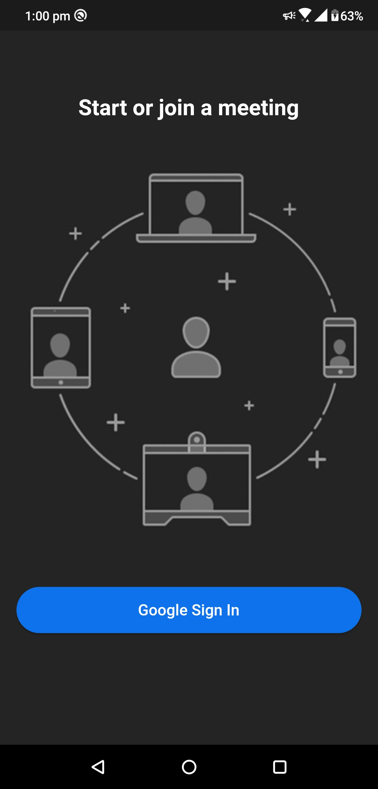
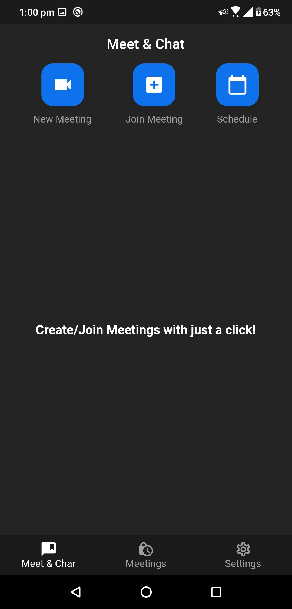
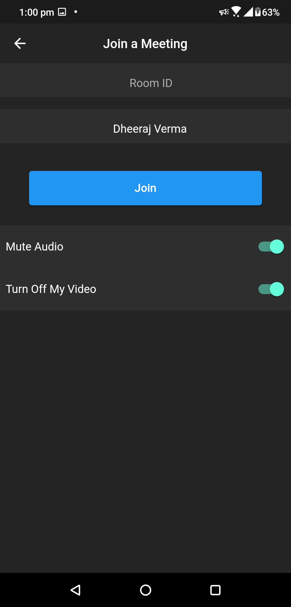
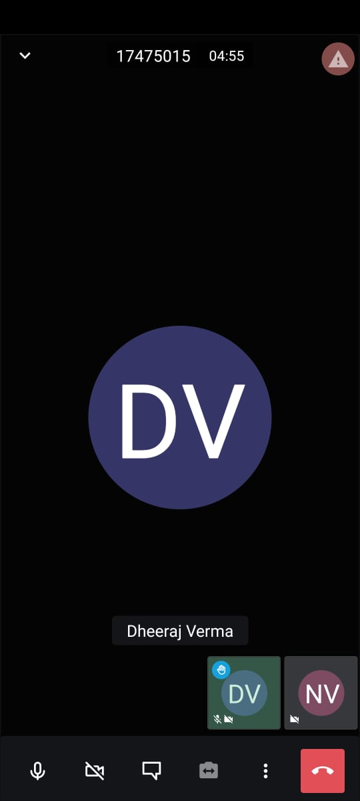
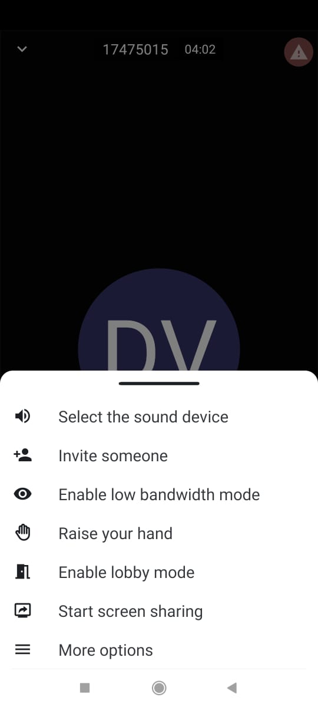
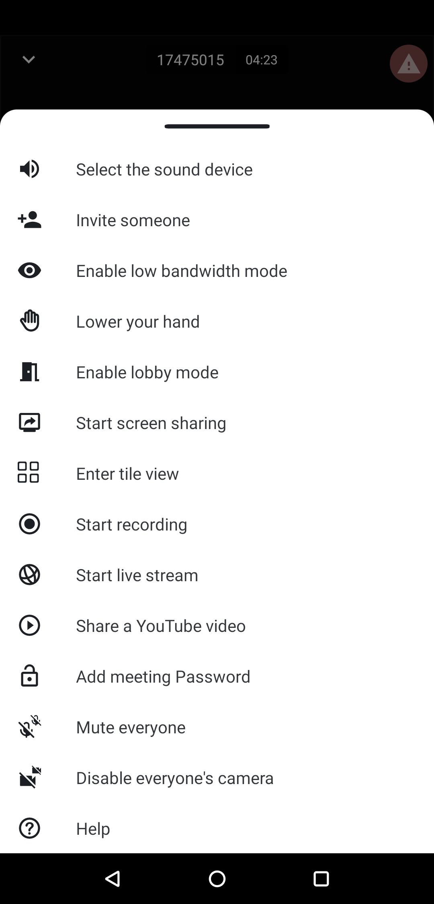

# Zoom Clone

## Description

 Developed a fully functional Videoconferencing  Mobile application using `Flutter`  with `Firebase Firestore` as backend and integrated `Jitsi SDK`.

## Key Features

* User authentication
* Storing User data
* Creating video meeting code
* Secure Video Videoconferencing among Multiple people
* Inviting Users for the Video conference
* Turn on Camera and Audio
* In-App Chatting
* Raise hand feature
* Recording Video conferences

## How to compile

1. Pull the project.
2. run ``pub get``
3. run ``flutter build apk --debug``
4. then run ``flutter build apk --profile``

## Screensots

    
    
    
    

    
    

## Getting Started

This project is a starting point for a Flutter application that follows the
[simple app state management
tutorial](https://flutter.dev/docs/development/data-and-backend/state-mgmt/simple).

For help getting started with Flutter, view our
[online documentation](https://flutter.dev/docs), which offers tutorials,
samples, guidance on mobile development, and a full API reference.
